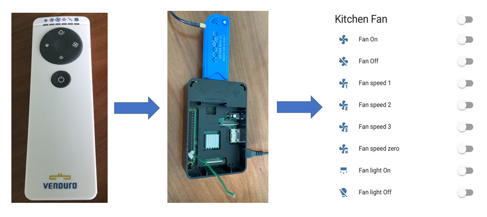

# record and replay Radio Frequency (RF) remote signal 
Record any replay any RF signal. (optional) Integrate with Home Assistant. Trigger replay with Alexa or Google Home.  

Common use cases: airconditioners, remote power plugs, fans, garage doors, shades and kitchen hoods.

## required hardware

* Raspberry Pi 
* radio receiver USB dongle (RTL-SDR with RTL2832U chipset)

## record and replay RF signal 

on your Pi
1. Install [Raspberry Pi OS](https://www.raspberrypi.org/downloads/raspberry-pi-os/). 
2. Install https://github.com/F5OEO/rpitx
3. Connect the RTL-SDR dongle to your Pi.
4. Record remote signal.  
> To find the frequency, your can install [SDR](https://www.rtl-sdr.com/big-list-rtl-sdr-supported-software/) software.  If the remote has an FCC id, you can look that up [here](https://fccid.io).  Common frequencies are: 433.92, 868.3, 315, 288, 300, 303, 306, 310, 318, 330, 390, 403.55 and 418 MHz.
```bash
cd rpitx
# this records on 868.00 MHz frequency and writes it to a fan-on-button.iq file
rtl_sdr -s 250000 -g 35 -f 868.0000e6 fan-on-button.iq
```
&nbsp;&nbsp;&nbsp;&nbsp;&nbsp; *above can also be done through the [rtlmenu.sh GUI](https://github.com/defcon24bit/record-and-replay-RF-remote/tree/master/docs/record-RF-signal-screenshots.md)*

5. CTRL + C to stop recording. (You can remove the RTL-SDR dongle when you're done recoding.  It's not required for sending)    
6. Add electrical wire to GPIO pin#7 (4th pin down, left row) - see [picture](https://github.com/defcon24bit/record-and-replay-RF-remote/tree/master/docs/pics/pi-elect-wire-on-pin-7.png).
7. Replay recording.  
```bash
sudo ./rpitx/sendiq -s 250000 -f 868.0000e6 -t u8 -i ./rpitx/fan-on-button.iq
```
<!--4. Launch the rpitx menu.
```bash
cd rpitx
./rtlmenu.sh
```
5. Set frequency, record and test replay - see [screenshot examples](https://github.com/defcon24bit/record-and-replay-RF-remote/tree/master/docs/record-RF-signal-screenshots.md).  
6. Rename the /rpitx/record.iq file.  
> The menu always uses the same file, so to avoid overwriting rename the file
```bash
cp record.iq on-button.iq
```
7. Go back to step 4. and repeat until you've recorded all buttons on your remote.    
-->

## integrate with Home Assistant

If you don't have HA yet, start [here](https://github.com/defcon24bit/record-and-replay-RF-remote/tree/master/docs/install-hassio.md).  

### add as switch 

Create a command line switch for everyone recording you want to replay.

```yaml
# configuration.yaml
switch:
  - platform: command_line
    switches:
      fan_on:
# ssh is only required if HA and rpitx run on different machines
        command_on: "ssh -i /config/id_rsa -o StrictHostKeyChecking=no -q pi@<YOUR.PI.IP.ADDRESS> sudo ./rpitx/sendiq -s 250000 -f 868.0000e6 -t u8 -i ./rpitx/fan-all-on.iq | wc -l >> /config/command.log"
        command_off: off
# HA doesn't get feedback if the device is on or off.  This returns the switch always back to the off-state.  
        command_state: off
        friendly_name: Fan On
```

### expose switch to 'emulated hue' component 

This will allow Alexa to see the switch as a Philips hue light.

```yaml
# configuration.yaml
emulated_hue:
  listen_port: 80
  expose_by_default: false
  entities:
    switch.fan_on:
      name: "fan on"
      hidden: false
```

### create automation that exposes switch as a webhook 

This will allow you to remotely trigger the switch via an HTTP POST request. 
Can be used with Google Home for example. 

```yaml
automation:
  - alias: webhook_fan_on
    trigger:
    - platform: webhook
      webhook_id: <PICK-A-RANDOM-WEBHOOK-ID>
    condition: []
    action:
    - data: {}
      entity_id: switch.fan_on
      service: switch.turn_on
    mode: single
```

### create certificate on HA

Only required if HA and rpitx run on different machines.  
The certificate allows to remote execute ssh commands on another machine without a password prompt. 

create certificate
```bash
ssh-keygen -t rsa -b 4096
```
send certificate to your pi (command still run on HA)
```bash
ssh-copy-id pi@<YOUR.PI.IP.ADDRESS>
```
> Initially,  HA gave errors when running the remote ssh commands.  I can't remember the exact fix.  It was either the HA user context not having access to the key files or the file and folder permissions for the certificate keys were not set correctly.  I think below two things fixed it.  Let me know if this works for you.

on HA
copy the id_rsa to the HA /config folder

on your Pi
```bash
chmod 700 ~/.ssh/
chmod 600 ~/.ssh/*
```

## create webhooks without HA

If you don't have HA, you can try creating webhooks with https://github.com/ncarlier/webhookd.
Protecting this setup is beyond the scope of this repository. It's not a question if you get hacked, but when.  
Consider using an [nginx proxy](https://nginx.org/en/), [Let's Encrypt](https://letsencrypt.org) and [Duck DNS](https://www.duckdns.org).

<!--
## create IFTTT Applets
1. Create a [new IFTTT Applet](https://ifttt.com/create).
2. Select '+This' -> 'Amazon Alexa' or 'Google Assistant' -> 'Say a specific/simple phrase'.
3. Select '+That' -> 'Webhooks' -> 'Make a web request'.
URL ```https://<YOUR-HA>/api/webhook/<YOUR-WEBHOOK-ID>```
Method: ```POST```.
-->

## credits 

All rights of the original authors reserved. 

[Creative Commons Zero v1.0 Universal license](https://github.com/defcon24bit/record-and-replay-RF-remote/tree/master/LICENSE)

